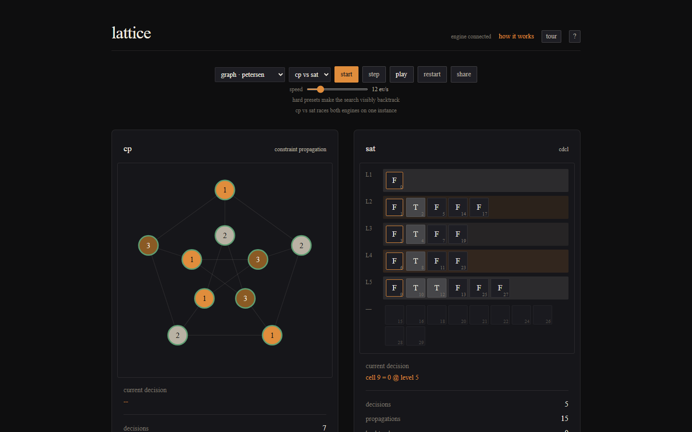
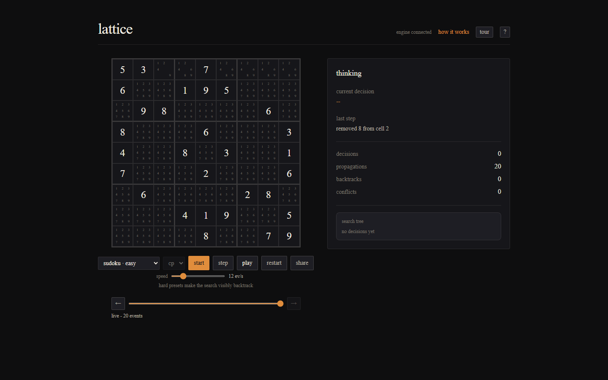
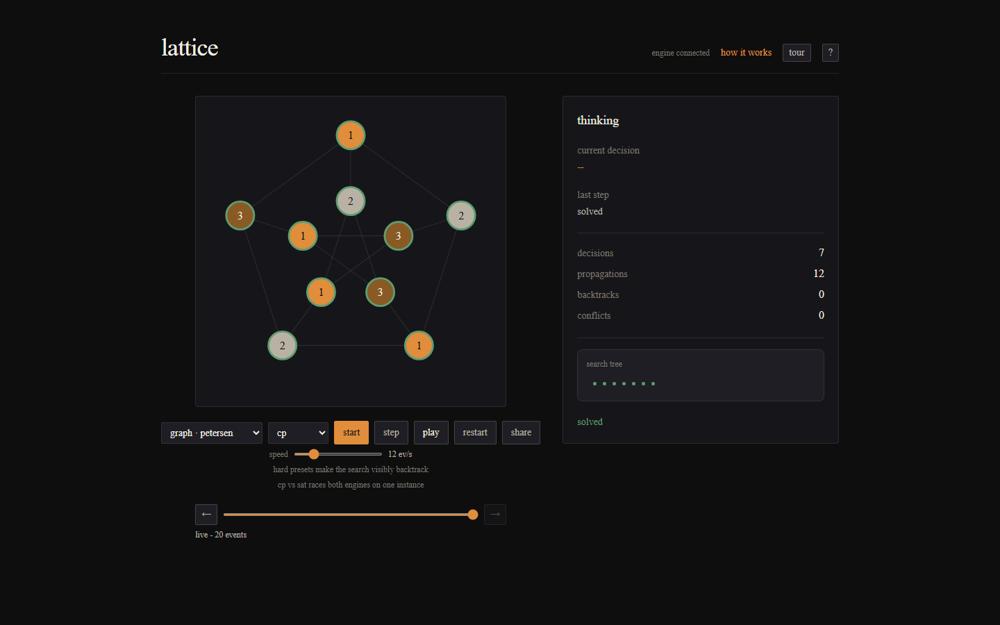
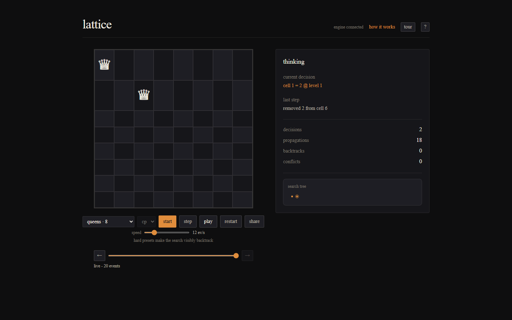
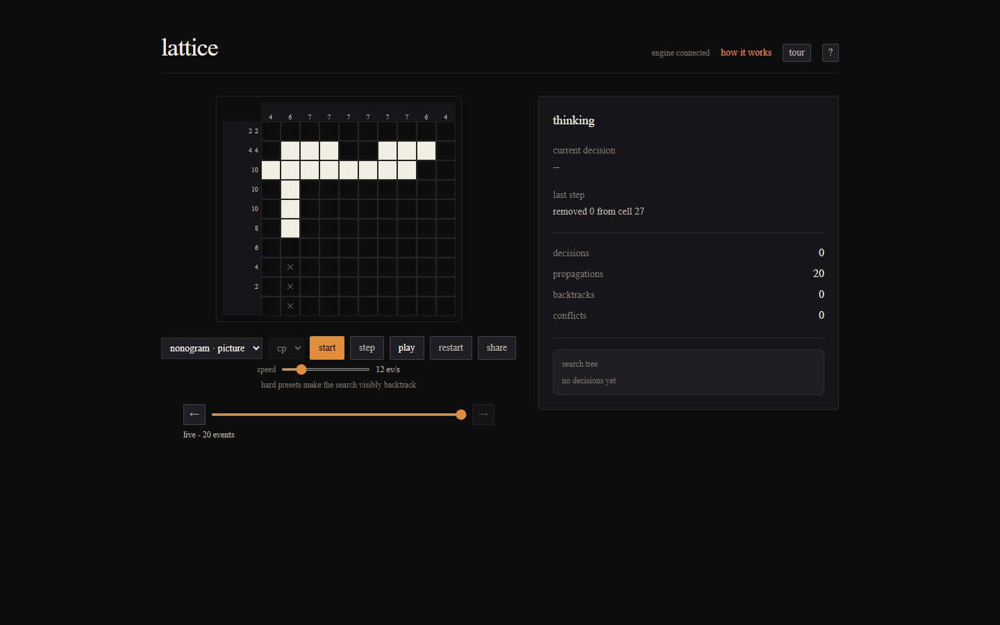
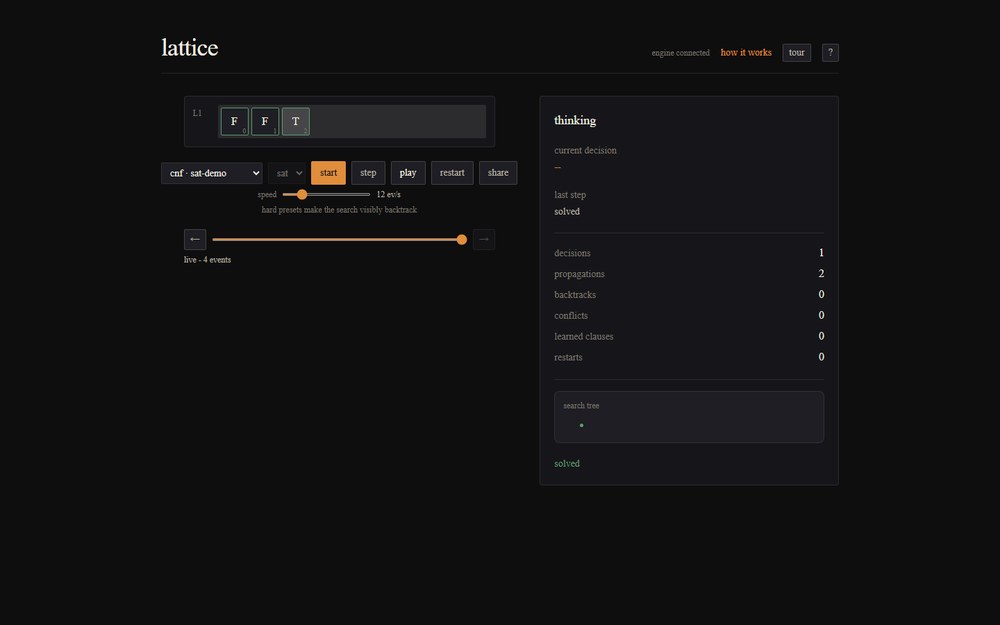

# lattice

lattice is a finite-domain constraint solver and a CDCL SAT solver, both written from scratch in Haskell, with a web front end that lets you watch them think. You give it a hard Sudoku, a graph to color, an N-queens board, a nonogram, or a raw CNF, and instead of just printing an answer it shows the work: candidates disappearing from cells as constraints propagate, the search committing to a value, a dead end flashing red, the whole thing backing up and trying again. A person with no background in this can follow the logic and feel the reasoning; someone who reads the source finds a real propagation engine and a real conflict-driven clause-learning engine, with a serious test suite behind both rather than a toy.



## What it does

- **A constraint-propagation (CP) engine.** Variables with finite domains, value-elimination propagators (all-different, not-equal, sum, comparison), a propagation queue that runs to a fixpoint, and a backtracking search that makes a decision only when propagation stalls and orders its choices with minimum-remaining-values, a degree tie-break, and least-constraining-value.
- **A CDCL SAT engine.** Watched-literal unit propagation, 1UIP conflict analysis with clause learning and non-chronological backjumping, VSIDS branching with phase saving, and a Luby restart schedule, plus DIMACS import. Held to the same correctness bar as the CP engine.
- **Four animated puzzle types** — Sudoku, graph coloring, N-queens, and nonograms — plus a SAT assignment-trail view for raw CNF, and a hard-instance preset for each that makes the search visibly struggle and recover.
- **An engine picker and a solver race.** Pick CP or SAT for an instance, or run both on the same dual-encoded problem side by side, each with its own counters, so you can see how differently they search.
- **A search-tree minimap, a step-back timeline, and a conflict explainer.** Scrub backward and forward through the reasoning you have already received, and inspect any conflict to see, honestly, what the engine eliminated and what it learned.
- **Shareable permalinks** that encode the whole instance in the URL (no database), a play-speed control, a keyboard-shortcut overlay, and an in-app explainer page that describes how the engines and the visualizer work.

The visualizer is built for legibility: it stays readable step by step with no animation, respects `prefers-reduced-motion`, and never uses color as the only signal for a state.

## Correctness comes first

A propagation or conflict-analysis bug is invisible on easy puzzles and silently wrong on hard ones, so correctness is enforced, not hoped for. The defense is differential testing against an exhaustive brute-force reference on small instances, and it landed in the first milestone rather than as something bolted on later.

- **CP:** every returned assignment satisfies its constraints; the solver never calls an instance unsolvable when a solution exists; propagation never throws away a value that belongs to some real solution.
- **SAT:** the two-watched-literal invariant holds after every step (checked in a debug build); every 1UIP learned clause is implied by the formula (a property test — `formula AND not-clause` is unsatisfiable, by the oracle); and DIMACS parse-then-print is identity on the fixtures.
- **Both:** a three-way differential dual-encodes a graph to CNF so the CP engine, the SAT engine, and the brute-force oracle must agree on satisfiability and on the unique solution.

The brute-force oracle is kept deliberately dumb so it is too simple to be wrong, and it only ever runs on instances small enough to finish fast. The differential is run at a high QuickCheck budget in CI, because a default-100-test pass that fails one run in fifteen is a real bug, not a flake — that is how a level-0 root-unit soundness bug in the SAT trail was caught and fixed.

## The one load-bearing idea

The hot loop is written once, generic over the monad, and takes a callback for emitting events. Fast mode runs it in `ST` with a callback that does nothing, which the compiler deletes, so the solver runs at full speed with no per-step overhead. Trace mode runs the same loop in `IO` with a callback that streams events to the browser over a WebSocket and can pause between steps. Both `ST` and `IO` are `PrimMonad`, so the mutable core is shared verbatim — the demo runs at human pace while a real solve stays fast, and the events the browser animates are the engine's genuine reasoning, not a scripted re-enactment.

## Build and run

The Haskell side runs in WSL on Ubuntu. The toolchain is GHC 9.12.2 and cabal 3.16.1.0, both pinned, with the dependency closure frozen and committed. A fresh clone is happiest on the Linux filesystem under your home directory rather than under `/mnt/c`, which keeps file IO and watching fast. Full setup is in `docs/DEVELOPMENT.md`.

Inside WSL, from the repo root:

```bash
cabal build all          # library, CLI, server, and test suite
cabal run lattice-cli -- puzzles/sudoku/easy.txt          # solve a puzzle (CP)
cabal run lattice-cli -- --sat puzzles/cnf/sat-demo.cnf   # solve a DIMACS CNF (SAT)
cabal test all           # the correctness suite — the bar for calling a change done
```

Format and lint before committing with `fourmolu --mode inplace $(git ls-files '*.hs')` and `hlint .`.

To watch it in the browser, start the streaming server in WSL and the web app on your host:

```bash
# in WSL, from the repo root
cabal run lattice-server          # binds 127.0.0.1:8080

# in web/, on the host (Node 22)
npm ci
npm run dev                       # the visualizer; open the printed URL
```

WSL forwards localhost, so the server bound to `127.0.0.1:8080` in WSL is reachable from your host browser at the same address. With the server running, `npm run verify:replay` (in `web/`) reconstructs every sample solution from the live engine stream, and `npm run walkthrough` drives a headless browser across the puzzle gallery at three breakpoints and runs the accessibility checks.

## Gallery

| Sudoku | Graph coloring | N-queens |
|---|---|---|
|  |  |  |

| Nonogram | SAT trail | Race (reduced motion) |
|---|---|---|
|  |  |  |

## What this is not

It is not trying to beat MiniSat or Glucose on speed or on industrial instances. The goal is a correct, legible, well-tested solver you can watch, not a benchmark winner. There is no SMT and no MaxSAT. There is no database and no accounts; shareable links are just the instance encoded in the URL. The MVP runs locally for the demo, and a client-side WebAssembly build is left as a maybe, since the GHC WASM backend is still a preview and the server-side design does not depend on it.

## Layout

- `src/Lattice/` — the engine. `Core` and `CP` are the constraint solver; `SAT` is the CDCL engine; `Encode` holds the puzzle encoders; `Event` and `Protocol` are the wire format; `Brute` is the exhaustive reference oracle.
- `app/` — the executables: `cli` (the terminal solver) and `server` (the Scotty + WebSockets streaming server).
- `test/` — the correctness suite, which carries the load.
- `puzzles/` — verified sample instances with known solutions (Sudoku, a graph, a nonogram, and CNF fixtures).
- `web/` — the Next.js visualizer.

## Documentation

In-depth docs live in [`docs/`](docs/README.md):

- [Architecture](docs/ARCHITECTURE.md) — the system, the data flow, and the two-mode engine design.
- [CP engine](docs/CP-ENGINE.md) and [SAT engine](docs/SAT-ENGINE.md) — how each solver works inside.
- [Protocol](docs/PROTOCOL.md) — the event and control wire format the visualizer animates.
- [Visualizer](docs/VISUALIZER.md) and [Design](docs/DESIGN.md) — the web app internals and the design tokens.
- [Testing](docs/TESTING.md) — the correctness contract and the differential tests.
- [Development](docs/DEVELOPMENT.md) — setup, build, run, and contributing.
- [Deployment](docs/DEPLOYMENT.md) — hosting the visualizer and running the engine.

## License

MIT.
